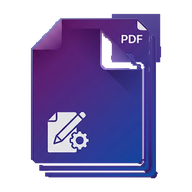

<div dir="rtl" align="center">



# PDF Studio — استوديو المستندات العربي

**كل أدوات PDF التي تحتاجها… على جهازك وبخصوصية تامة.**

[](https://github.com/AHKH3/pdf-studio/releases)
[](https://github.com/AHKH3/pdf-studio/releases)
[](https://github.com/AHKH3/pdf-studio/releases/latest/download/PDFStudio-Setup.exe)
[](PRODUCT.md)
[](PRODUCT.md)

تطبيق سطح مكتب (Windows) عربي بالكامل (RTL) يعمل **100% محليًا**: لا رفع ملفات، لا حسابات، لا اشتراكات، لا حدود مصطنعة — كل المعالجة تجري داخل جهازك، ويعمل بكامل طاقته دون إنترنت.

⬇️ **[تنزيل PDFStudio-Setup.exe (أحدث إصدار)](https://github.com/AHKH3/pdf-studio/releases/latest/download/PDFStudio-Setup.exe)** — ويندوز 10 / 11 فقط · 🌐 **[صفحة التنزيل](https://ahkh3.github.io/pdf-studio/)**

</div>

<div dir="rtl">

---

## الأدوات (10 أدوات — الإصدار 1.0.20)

| # | الأداة | الدخل | ماذا تفعل |
|---|---|---|---|
| 1 | **صور ← PDF** (مسح) | صور (JPG/PNG/WebP/HEIC) | كشف تلقائي للحواف (وضع سريع عند الرفع + وضع دقيق متعدد الوصفات لكل صفحة)، 5 أنماط معالجة (ملوّن/تباين/رمادي/أبيض-أسود/الأصل)، مقاسات A4/A5/A3/ملائم، تحسين اختياري بالذكاء الاصطناعي، ووضع بطاقة هوية ID-1 بمقاسها الحقيقي |
| 2 | **دمج** | عدة PDF | جمع ملفات PDF في ملف واحد مع ترتيب بالسحب والإفلات |
| 3 | **ترتيب** | PDF واحد (+ إدراج) | معاينة مصغرة لكل الصفحات: إعادة ترتيب بالسحب، تدوير، حذف، وإدراج PDF أو صور بعد أي صفحة |
| 4 | **تقسيم** | PDF واحد | نطاقات محددة (`1-3, 5, 8-12`)، كل N صفحة، كل صفحة في ملف، أو استخراج صفحات في ملف واحد |
| 5 | **ضغط** | PDF واحد | 4 مستويات (خفيف/متوازن/قوي/أقصى) + تحويل اختياري للرمادي — للمستندات الممسوحة (يحوّل الصفحات لصور، فالنص يفقد قابلية البحث) |
| 6 | **ترقيم** | PDF واحد | 5 قوالب (`1`، `- 1 -`، `1 / 20`، `[ 1 ]`، `صفحة 1`) بمواضع مخصصة — الأرقام العربية تُرسم كصور PNG لأن خطوط pdf-lib لا تدعم العربية |
| 7 | **PDF ← صور** | PDF واحد | رسم الصفحات بدقة عالية PNG/JPG وحفظها في ZIP أو مجلد |
| 8 | **تعديل PDF** | PDF واحد | نص منسّق في أي موضع، رسم يدوي، صور مع تدوير/تحجيم، وأشكال هندسية — طبقات تُدمج فوق الصفحة (لا تعديل للنص الأصلي) |
| 9 | **قص** | PDF واحد | صندوق قص مرئي للصفحة الحالية أو كل الصفحات |
| 10 | **صور أصلية** | PDF واحد | استخراج الصور المدمجة بأبعادها وجودتها الأصلية دون إعادة ضغط |

> أدوات التوقيع والحماية والعلامة المائية والبحث (OCR) **حُذفت من التطبيق تمامًا** بقرار المالك بتاريخ 2026-09-06 (راجع [`docs/DECISIONS.md`](docs/DECISIONS.md)).

## مزايا الصدفة (Shell)

- **تابات متعددة** بعزل كامل للحالة: نفس الأداة على نفس الملف في تابين = نسختان مستقلتان تمامًا، مع تحذير عند إغلاق عمل غير محفوظ (`Ctrl+T` تاب جديدة، `Ctrl+W` إغلاق)
- **الرئيسية دائمًا**: حاوية الملفات + اختيار الأداة، مع الملفات الأخيرة (محلية فقط) وتثبيت/إخفاء الأدوات
- **الوضع الفاتح/الداكن**: نظام Lumen Glow v2 (أبيض نقي/أسود نقي + هالة Indigo واحدة)، خطوط Amiri + Noto Naskh Arabic + Playfair Display مضمّنة محليًا
- **تحديثات صامتة**: NSIS one-click per-user عبر `electron-updater` + مهمة خلفية كل 6 ساعات — التثبيت يعيد فتح التطبيق تلقائيًا
- **حماية من الأحمال الثقيلة**: تحذير قبل الملفات > 100MB أو المستندات > 120 صفحة، وتقدّم حقيقي قابل للإلغاء للعمليات الطويلة
- **اختصارات لوحة مفاتيح** لكل الأدوات، وتباين AA ودعم `prefers-reduced-motion`

## التشغيل والتطوير

```bash
npm install   # ينسخ المكتبات المورّدة إلى assets/vendor تلقائيًا (postinstall)
npm start     # تشغيل التطبيق (electron .)
npm test      # حزمة الفحوص الكاملة (12 سكربت — يجب أن تبقى خضراء)
npm run dist  # بناء مثبّت ويندوز NSIS في release/
```

| أمر | الغرض |
|---|---|
| `npm run vendor` | إعادة نسخ `pdf-lib` / `pdfjs-dist` / `sortablejs` إلى `assets/vendor` بعد أي تحديث للاعتمادات |
| `npm run check` | فحص صياغة سريع |
| `npm run pack` | حزمة تجريبية دون مثبّت (`electron-builder --dir`) |

> ملاحظة Windows: المستودع معياره **LF**. لا يوجد `.gitattributes`، ففحوص قراءة المصادر تطبّع النهايات أولًا — أي ملف جديد يُحفظ بـ LF.

### البنية باختصار

- `electron/main.cjs` — سيرفر HTTP محلي على `127.0.0.1` (CSP صارمة + `contextIsolation` + `sandbox`) يقدّم الواجهة، حوارات حفظ/مجلد أصلية، وقناة التحديثات
- `index.html` + `assets/` — واجهة ثابتة: كل أداة `view-*` + وحدة `assets/js/tools/*` بنمط Manifest موحّد (`mount`/`enter`/`run`/`captureState`/`restoreState`)
- محركات محلية فقط: `pdf-lib` (كتابة) + `pdf.js` (عرض) + OpenCV.js (كشف الحواف) + TF.js/WASM (رفع الجودة) + `heic2any` (صور HEIC)
- `landing/` — صفحة هبوط ثابتة تُنشر على GitHub Pages (بلا أي خدمة خارجية، خطوط وأيقونات محلية)
- `.github/workflows/` — `release.yml` (بناء NSIS ونشره على Releases مع رفع نسخة تلقائي عند كل push) + `pages.yml` (نشر الهبوط)

التفاصيل الكاملة: [`docs/PROJECT.md`](docs/PROJECT.md) (النطاق) · [`docs/ARCHITECTURE.md`](docs/ARCHITECTURE.md) (الخريطة) · [`PRODUCT.md`](PRODUCT.md) (المنتج) · [`DESIGN.md`](DESIGN.md) (التصميم) · [`docs/DECISIONS.md`](docs/DECISIONS.md) (سجل القرارات)

## النشر

1. ادفع إلى `main` — يُبنى المثبّت ويُنشر Release تلقائيًا، وتُنشر صفحة الهبوط على Pages
2. أو ادفع tag بصيغة `v*` لإصدار مثبت برقم محدد
3. التطبيق المثبّت يحدّث نفسه بصمت ويعيد الفتح دون نقرات

## الخصوصية

لا خادم، لا تتبّع، لا قياس استخدام. مستنداتك لا تغادر جهازك أبدًا — هذا مبدأ معماري (راجع `PRODUCT.md`) وليس مجرد وعد تسويقي.
